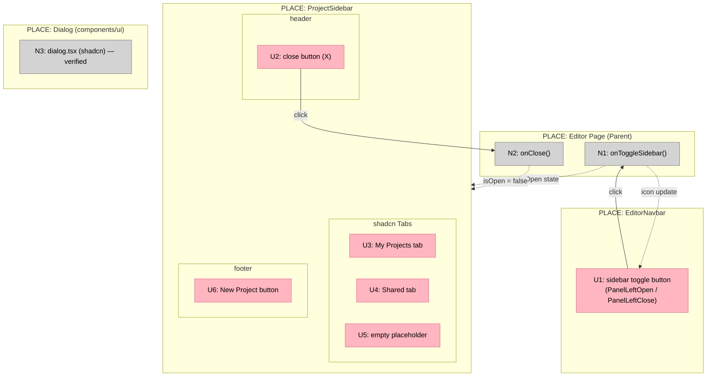
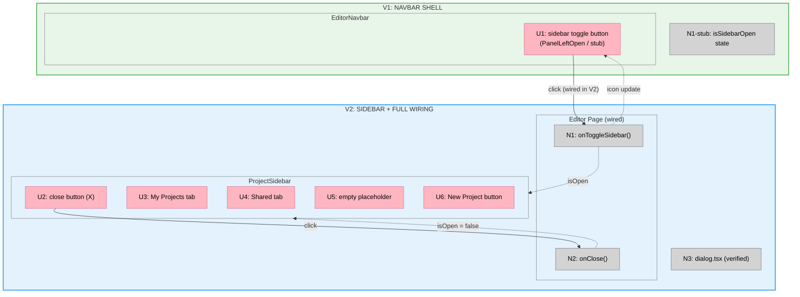

# 02 Editor Chrome — Big Picture

**Selected shape:** A (Props-Controlled Floating Chrome)

---

## Frame

### Problem

- The editor workspace has no persistent chrome layer — no top navbar and no sidebar shell.
- Without a navbar, there is no structural frame for workspace controls, navigation toggles, or future editor actions.
- Without a sidebar, there is no way to switch projects or access project management from within the editor.
- These structural components must exist before any other editor feature can be composed on top of them.

### Outcome

- Every editor screen shares a reusable top navbar and floating left sidebar shell.
- The navbar provides a three-section frame with a sidebar toggle and reserved space for future controls.
- The sidebar is a floating overlay with project tabs and a primary action — it does not displace canvas content.
- The dialog styling pattern is confirmed and available for subsequent features to use without modification.

---

## Shape

### Fit Check (R × A)

| Req | Requirement | Status | A |
|-----|-------------|--------|---|
| R0 | Editor chrome is the reusable structural shell for all editor screens | Core goal | ✅ |
| R1 | Navbar provides a persistent top bar with toggle, layout sections, and dark theme | Must-have | ✅ |
| R1.1 | Fixed-height top navbar visible across all editor screens | Must-have | ✅ |
| R1.2 | Three layout sections: left, center, right | Must-have | ✅ |
| R1.3 | Left section contains sidebar toggle using PanelLeftOpen / PanelLeftClose icons | Must-have | ✅ |
| R1.4 | Right section is empty — reserved for future controls | Must-have | ✅ |
| R1.5 | Dark background with subtle bottom border | Must-have | ✅ |
| R2 | Sidebar is a floating overlay that slides in from the left | Must-have | ✅ |
| R2.1 | Sidebar floats above the canvas — does not push or shift content | Must-have | ✅ |
| R2.2 | Slide-in animation from the left | Must-have | ✅ |
| R2.3 | Controlled via `isOpen` and `onClose` props — parent manages state | Must-have | ✅ |
| R2.4 | Header contains "Projects" title and close button | Must-have | ✅ |
| R2.5 | My Projects and Shared tabs — both show empty placeholder state | Must-have | ✅ |
| R2.6 | Full-width "New Project" button with Plus icon at bottom | Must-have | ✅ |
| R3 | Dialog pattern is confirmed and ready for use in subsequent features | Must-have | ✅ |
| R3.1 | Uses color tokens from `globals.css` — no hardcoded hex values | Must-have | ✅ |
| R3.2 | Supports title, description, and footer actions | Must-have | ✅ |
| R4 | TypeScript strict-mode clean — no type errors, no lint violations | Must-have | ✅ |
| R5 | Components are designed for extension across future editor features | Must-have | ✅ |

### Parts

| Part | Mechanism | Flag |
|------|-----------|:----:|
| **A1** | **EditorNavbar** (`components/editor/editor-navbar.tsx`) | |
| A1.1 | Fixed-height bar (`h-12`, `flex items-center`), three layout sections | |
| A1.2 | Toggle button: PanelLeftOpen when closed, PanelLeftClose when open; calls `onToggleSidebar` | |
| A1.3 | Dark background (`bg-surface`) with subtle bottom border (`border-b border-default`) | |
| **A2** | **ProjectSidebar** (`components/editor/project-sidebar.tsx`) | |
| A2.1 | Fixed-position overlay (`fixed inset-y-0 left-0 z-50`), translate-x slide animation | |
| A2.2 | Controlled by `isOpen: boolean` + `onClose: () => void` props | |
| A2.3 | Header: "Projects" label + X close button | |
| A2.4 | shadcn `Tabs` — My Projects / Shared, both with empty placeholder state | |
| A2.5 | Full-width "New Project" button with Plus icon pinned to bottom | |
| **A3** | **Dialog pattern** | |
| A3.1 | `components/ui/dialog.tsx` (shadcn) — confirm it supports title, description, footer with globals.css tokens | |

### Breadboard

**Legend:**
- **Pink nodes (U)** = UI affordances (things users see and interact with)
- **Grey nodes (N)** = Code affordances (handlers, state, services)
- **Solid lines** = Wires Out (calls, triggers)
- **Dashed lines** = Returns To (state updates)

---

## Slices

### Sliced Breadboard

### Slices Grid

|  |  |
|:--|:--|
| **[V1: NAVBAR SHELL](./02-editor-v1-plan.md)** ⏳ PENDING  • Create `editor-navbar.tsx` • Fixed-height bar, three sections • Toggle button (PanelLeftOpen/Close) • Stub `isOpen` state in parent  *Demo: Navbar renders; toggle changes icon* | **[V2: SIDEBAR + FULL WIRING](./02-editor-v2-plan.md)** ⏳ PENDING  • Create `project-sidebar.tsx` • Floating overlay, translate-x animation • My Projects / Shared tabs (empty state) • Wire toggle + close; verify dialog.tsx  *Demo: Toggle opens sidebar; X closes it; tabs switch; dialog confirmed* |
