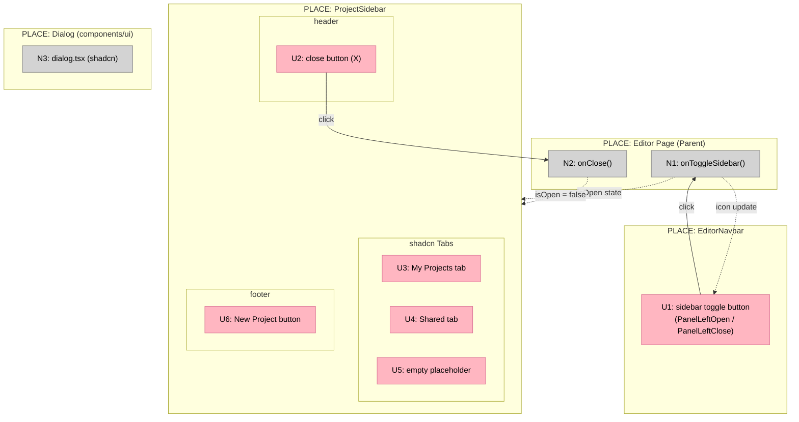

# 02 Editor Chrome — Shaping

## Requirements (R)

| ID | Requirement | Status |
|----|-------------|--------|
| R0 | Editor chrome is the reusable structural shell for all editor screens | Core goal |
| R1 | Navbar provides a persistent top bar with toggle, layout sections, and dark theme | Must-have |
| R1.1 | Fixed-height top navbar visible across all editor screens | Must-have |
| R1.2 | Three layout sections: left, center, right | Must-have |
| R1.3 | Left section contains sidebar toggle using PanelLeftOpen / PanelLeftClose icons | Must-have |
| R1.4 | Right section is empty — reserved for future controls | Must-have |
| R1.5 | Dark background with subtle bottom border | Must-have |
| R2 | Sidebar is a floating overlay that slides in from the left | Must-have |
| R2.1 | Sidebar floats above the canvas — does not push or shift content | Must-have |
| R2.2 | Slide-in animation from the left | Must-have |
| R2.3 | Controlled via `isOpen` and `onClose` props — parent manages state | Must-have |
| R2.4 | Header contains "Projects" title and close button | Must-have |
| R2.5 | My Projects and Shared tabs — both show empty placeholder state | Must-have |
| R2.6 | Full-width "New Project" button with Plus icon at bottom | Must-have |
| R3 | Dialog pattern is confirmed and ready for use in subsequent features | Must-have |
| R3.1 | Uses color tokens from `globals.css` — no hardcoded hex values | Must-have |
| R3.2 | Supports title, description, and footer actions | Must-have |
| R4 | TypeScript strict-mode clean — no type errors, no lint violations | Must-have |
| R5 | Components are designed for extension across future editor features | Must-have |

---

## CURRENT: Before This Feature

| Part | State |
|------|-------|
| EditorNavbar | Does not exist |
| ProjectSidebar | Does not exist |
| Dialog | `components/ui/dialog.tsx` exists (shadcn-generated) but not verified against feature requirements |

---

## Shape A: Props-Controlled Floating Chrome

Two separate controlled components — `EditorNavbar` and `ProjectSidebar` — with sidebar open/close state managed in the parent via props.

**Selected shape.** The spec prescribes component files, a floating overlay, and prop-controlled state. No competing shapes were identified.

| Part | Mechanism | Flag |
|------|-----------|:----:|
| **A1** | **EditorNavbar** (`components/editor/editor-navbar.tsx`) | |
| A1.1 | Fixed-height bar (`h-12`, `flex items-center justify-between`), three layout sections | |
| A1.2 | Toggle button in left section: renders `PanelLeftOpen` when sidebar is closed, `PanelLeftClose` when open; calls `onToggle` prop | |
| A1.3 | Dark background (`bg-surface`) with subtle bottom border (`border-b border-default`) | |
| **A2** | **ProjectSidebar** (`components/editor/project-sidebar.tsx`) | |
| A2.1 | Fixed-position overlay (`fixed inset-y-0 left-0`), above canvas z-index; CSS translate-x animation for slide-in | |
| A2.2 | Controlled by `isOpen: boolean` + `onClose: () => void` props | |
| A2.3 | Header row: "Projects" label + X icon close button that calls `onClose` | |
| A2.4 | shadcn `Tabs` with "My Projects" and "Shared" triggers; both tab panels show empty placeholder state | |
| A2.5 | Full-width "New Project" button with `Plus` icon pinned to the sidebar bottom | |
| **A3** | **Dialog pattern** | |
| A3.1 | `components/ui/dialog.tsx` (shadcn-generated) already uses `globals.css` tokens; confirm it renders title, description, and footer actions | |

---

## Fit Check (R × A)

| Req | Requirement | Status | A |
|-----|-------------|--------|---|
| R0 | Editor chrome is the reusable structural shell for all editor screens | Core goal | ✅ |
| R1 | Navbar provides a persistent top bar with toggle, layout sections, and dark theme | Must-have | ✅ |
| R1.1 | Fixed-height top navbar visible across all editor screens | Must-have | ✅ |
| R1.2 | Three layout sections: left, center, right | Must-have | ✅ |
| R1.3 | Left section contains sidebar toggle using PanelLeftOpen / PanelLeftClose icons | Must-have | ✅ |
| R1.4 | Right section is empty — reserved for future controls | Must-have | ✅ |
| R1.5 | Dark background with subtle bottom border | Must-have | ✅ |
| R2 | Sidebar is a floating overlay that slides in from the left | Must-have | ✅ |
| R2.1 | Sidebar floats above the canvas — does not push or shift content | Must-have | ✅ |
| R2.2 | Slide-in animation from the left | Must-have | ✅ |
| R2.3 | Controlled via `isOpen` and `onClose` props — parent manages state | Must-have | ✅ |
| R2.4 | Header contains "Projects" title and close button | Must-have | ✅ |
| R2.5 | My Projects and Shared tabs — both show empty placeholder state | Must-have | ✅ |
| R2.6 | Full-width "New Project" button with Plus icon at bottom | Must-have | ✅ |
| R3 | Dialog pattern is confirmed and ready for use in subsequent features | Must-have | ✅ |
| R3.1 | Uses color tokens from `globals.css` — no hardcoded hex values | Must-have | ✅ |
| R3.2 | Supports title, description, and footer actions | Must-have | ✅ |
| R4 | TypeScript strict-mode clean — no type errors, no lint violations | Must-have | ✅ |
| R5 | Components are designed for extension across future editor features | Must-have | ✅ |

**Shape A passes all requirements.**

---

## Breadboard

### UI Affordances

| ID | Affordance | Place | Wires Out |
|----|-----------|-------|-----------|
| U1 | Sidebar toggle button (PanelLeftOpen / PanelLeftClose icon) | EditorNavbar — left section | → N1 |
| U2 | Close button (X icon) | ProjectSidebar — header | → N2 |
| U3 | "My Projects" tab trigger | ProjectSidebar — tabs | (local tab state) |
| U4 | "Shared" tab trigger | ProjectSidebar — tabs | (local tab state) |
| U5 | Empty placeholder content | ProjectSidebar — tab panels | — |
| U6 | "New Project" button (Plus icon) | ProjectSidebar — footer | (deferred — wired in future feature) |

### Non-UI Affordances

| ID | Affordance | Wires Out |
|----|-----------|-----------|
| N1 | `onToggleSidebar()` — toggles `isOpen` state in parent | → ProjectSidebar visibility, U1 icon |
| N2 | `onClose()` — sets `isOpen = false` in parent | → ProjectSidebar visibility |
| N3 | `dialog.tsx` — shadcn component, already generated | (verified, no changes needed) |

### Wiring Diagram

**Legend:**
- **Pink nodes (U)** = UI affordances (things users see and interact with)
- **Grey nodes (N)** = Code affordances (handlers, state, services)
- **Solid lines** = Wires Out (calls, triggers)
- **Dashed lines** = Returns To (data flow, state updates)

---

## Key Decisions

| Decision | Choice | Rationale |
|----------|--------|-----------|
| Sidebar layout approach | Floating overlay (not layout-push) | Canvas must remain full-width and unaffected by sidebar open state |
| State ownership | Parent via props (`isOpen`, `onClose`) | Keeps sidebar stateless and reusable; parent controls when and how it opens |
| Component structure | Two separate files | Navbar and sidebar are independently reusable and have different lifecycles |
| Dialog pattern | Confirm existing shadcn component | `components/ui/dialog.tsx` already uses `globals.css` tokens — no new work needed |
| Sidebar tabs | shadcn `Tabs` with empty state | Establishes the slot for project lists without implementing data fetching in this feature |
