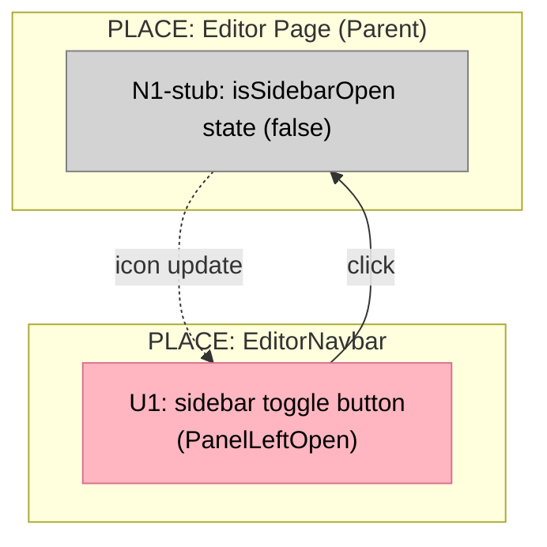
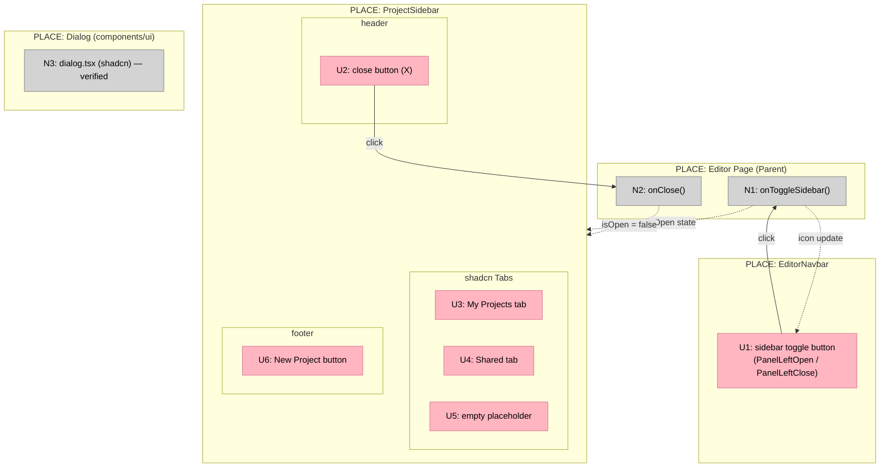
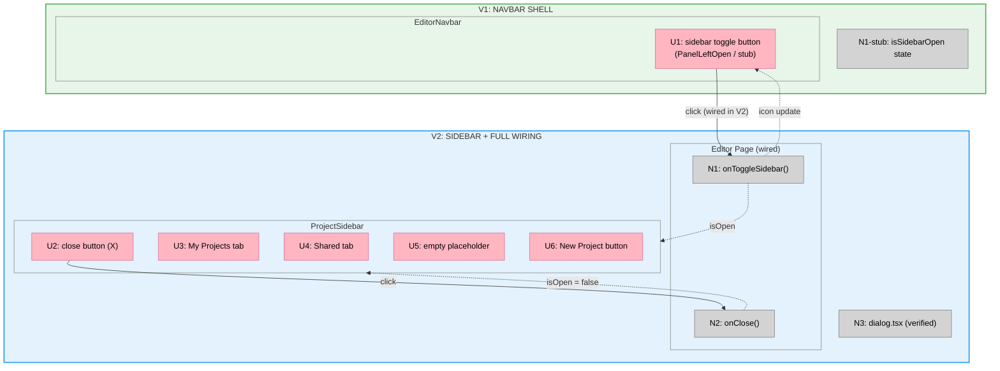

# 02 Editor Chrome — Slices

**Selected shape:** A (Props-Controlled Floating Chrome)

---

## Slices Overview

| Slice | Name | Demo |
|-------|------|------|
| V1 | Navbar Shell | Navbar renders on editor page; toggle button present with PanelLeftOpen icon |
| V2 | Sidebar + Full Wiring | Toggle opens sidebar (slides in); X closes it; My Projects/Shared tabs switch; dialog confirmed |

---

## V1: Navbar Shell

### Goal

Create `EditorNavbar` as a standalone component. The sidebar does not exist yet — the toggle button renders with a stub state in the parent. Everything visible in the navbar is correct and complete.

### UI Affordances

| ID | Affordance | Place | Wires Out |
|----|-----------|-------|-----------|
| U1 | Sidebar toggle button (PanelLeftOpen icon — stub state) | EditorNavbar — left section | → parent `onToggleSidebar` (stub) |

### Non-UI Affordances

| ID | Affordance | Wires Out |
|----|-----------|-----------|
| N1-stub | `isSidebarOpen` boolean state in parent (default `false`) | → U1 icon |

### Wiring

### Files

| Action | File |
|--------|------|
| Create | `components/editor/editor-navbar.tsx` |
| Update | Editor page (add navbar with stub state) |

### Demo

> Navbar renders across the top of the editor page. Dark background, subtle bottom border, three sections. Toggle button shows PanelLeftOpen icon. Clicking it toggles the icon to PanelLeftClose and back.

---

## V2: Sidebar + Full Wiring

### Goal

Create `ProjectSidebar` and wire everything together. The navbar toggle now drives real sidebar visibility. Close button, tabs, and New Project button are all in place. Dialog pattern confirmed.

### UI Affordances

| ID | Affordance | Place | Wires Out |
|----|-----------|-------|-----------|
| U1 | Sidebar toggle button (PanelLeftOpen / PanelLeftClose — wired) | EditorNavbar — left section | → N1 |
| U2 | Close button (X icon) | ProjectSidebar — header | → N2 |
| U3 | "My Projects" tab trigger | ProjectSidebar — tabs | (local shadcn tab state) |
| U4 | "Shared" tab trigger | ProjectSidebar — tabs | (local shadcn tab state) |
| U5 | Empty placeholder content | ProjectSidebar — tab panels | — |
| U6 | "New Project" button (Plus icon) | ProjectSidebar — footer | (deferred — wired in future feature) |

### Non-UI Affordances

| ID | Affordance | Wires Out |
|----|-----------|-----------|
| N1 | `onToggleSidebar()` — toggles `isOpen` in parent | → `ProjectSidebar.isOpen`, U1 icon |
| N2 | `onClose()` — sets `isOpen = false` in parent | → `ProjectSidebar.isOpen` |
| N3 | `dialog.tsx` — shadcn component verified | (no changes; confirmed ready) |

### Wiring

### Files

| Action | File |
|--------|------|
| Create | `components/editor/project-sidebar.tsx` |
| Update | Editor page (wire real `isOpen` state to sidebar and navbar) |
| Verify | `components/ui/dialog.tsx` (confirm title / description / footer pattern works) |

### Demo

> Click the navbar toggle → sidebar slides in from the left. Click X or toggle again → sidebar slides out. My Projects and Shared tabs are switchable. New Project button visible at bottom. Dialog renders correctly with title, description, and footer when tested directly.

---

## Sliced Breadboard

**Legend:**
- **Green subgraph** = V1: Navbar Shell
- **Blue subgraph** = V2: Sidebar + Full Wiring
- **Pink nodes (U)** = UI affordances
- **Grey nodes (N)** = Code affordances
- **Solid lines** = Wires Out
- **Dashed lines** = Returns To / state updates
