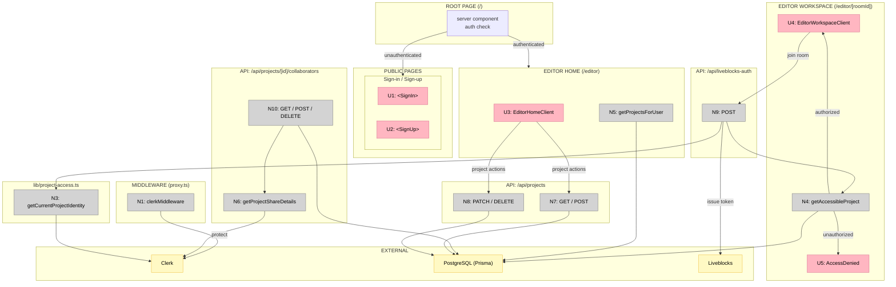
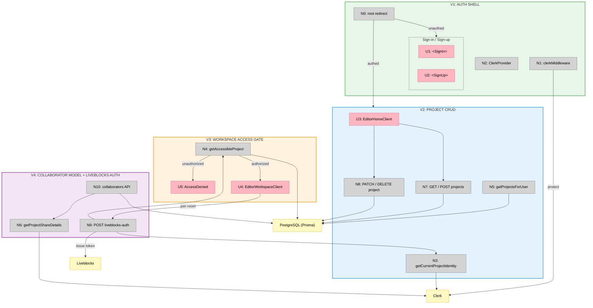

# Feature 03 — Auth — Big Picture

**Selected shape:** A (Clerk-native auth with email-based collaboration)

---

## Frame

### Problem

- Unauthenticated users can reach protected routes with no redirect
- Canvas projects have no owner — there is no user identity in the system
- Collaborators have no structured way to access shared projects
- Liveblocks rooms have no auth gate — any request can join any room

### Outcome

- Users sign in via Clerk and are redirected away from protected routes if unauthenticated
- Every project has a single owner (Clerk user ID)
- Collaborators can be invited by email and access their shared projects
- Liveblocks room tokens are only issued to verified project members
- Clerk sign-in/sign-up UI matches the app's dark design system

---

## Shape

### Fit Check (R × A)

| Req | Requirement                                                               | Status    | A  |
| --- | ------------------------------------------------------------------------- | --------- | -- |
| R0  | Users can sign in and sign up                                             | Core goal | ✅ |
| R1  | Unauthenticated requests to protected routes redirect to /sign-in         | Must-have | ✅ |
| R2  | Authenticated users land on the editor home (project list)                | Must-have | ✅ |
| R3  | Users can create, rename, and delete projects (owner only)                | Must-have | ✅ |
| R4  | Project list separates owned projects from shared (collaborator) projects | Must-have | ✅ |
| R5  | Only the owner or a collaborator can access a project workspace           | Must-have | ✅ |
| R6  | The owner can add and remove collaborators by email                       | Must-have | ✅ |
| R7  | API route mutations enforce auth and ownership checks at every boundary   | Must-have | ✅ |
| R8  | Liveblocks room tokens are issued only to verified project members        | Must-have | ✅ |
| R9  | Clerk sign-in/sign-up appearance matches the app's dark design system     | Must-have | ✅ |

### Parts

| Part    | Mechanism                                                                                                                                                  | Flag |
| ------- | ---------------------------------------------------------------------------------------------------------------------------------------------------------- | :--: |
| **A1**  | **Route protection** — `proxy.ts`: `clerkMiddleware` + `createRouteMatcher`; all routes protected except `/sign-in(.*)` and `/sign-up(.*)`                 |      |
| **A2**  | **Clerk provider** — `app/layout.tsx`: `ClerkProvider` with dark theme `appearance` vars mapped to the app's CSS custom property tokens                    |      |
| **A3**  | **Sign-in / Sign-up pages** — split-panel layout: marketing left column + Clerk embedded `<SignIn>` / `<SignUp>` on the right                              |      |
| **A4**  | **Root redirect** — `app/page.tsx`: server component; authenticated → `/editor`, unauthenticated → `/sign-in`                                             |      |
| **A5**  | **Project DB model** — `prisma/models/project.prisma`: `Project` (ownerId, name, status, canvasBlobUrl), `ProjectCollaborator` (projectId + email unique), `ProjectSpec`, `TaskRun` | |
| **A6**  | **Project access helpers** — `lib/project-access.ts`: `getCurrentProjectIdentity()`, `getAccessibleProject()` (owner OR email-matched collaborator), `userHasProjectAccess()` | |
| **A7**  | **Project CRUD API** — `GET /api/projects` (list owned); `POST` (create); `PATCH /api/projects/[id]` (rename, owner only); `DELETE` (delete, owner only)  |      |
| **A8**  | **Collaborator management API** — `GET/POST/DELETE /api/projects/[id]/collaborators`; owner-only mutations; Clerk profile lookup for display names/avatars |      |
| **A9**  | **Liveblocks auth endpoint** — `POST /api/liveblocks-auth`: verifies membership via `userHasProjectAccess()`, issues session token with userInfo           |      |
| **A10** | **Editor home page** — `app/editor/page.tsx`: fetches owned + shared projects via `getProjectsForUser()`, passes to `EditorHomeClient`                     |      |
| **A11** | **Editor workspace access gate** — `app/editor/[roomId]/page.tsx`: `getAccessibleProject()` → unauthorized → `<AccessDenied>`, authorized → `<EditorWorkspaceClient>` | |

### Breadboard

**Legend:**
- **Pink nodes (U)** = UI affordances (things users see / interact with)
- **Grey nodes (N)** = Code affordances (middleware, handlers, helpers)
- **Yellow nodes** = External services (Clerk, PostgreSQL, Liveblocks)
- **Solid lines** = Wires Out (calls, triggers, writes)

---

## Slices

### Sliced Breadboard

### Slices Grid

|  |  |
|:--|:--|
| **[V1: AUTH SHELL](./03-auth-v1-plan.md)** ⏳ PENDING  • `proxy.ts` clerkMiddleware • `ClerkProvider` + dark appearance • Sign-in / Sign-up split-panel pages • Root redirect (authed → /editor)  *Demo: Visit app → sign-in redirect. Sign in → editor (empty).* | **[V2: PROJECT CRUD](./03-auth-v2-plan.md)** ⏳ PENDING  • Prisma Project + Collaborator models • `getCurrentProjectIdentity`, `getProjectsForUser` • GET / POST / PATCH / DELETE project APIs • Editor home server component  *Demo: Create project → appears in My Projects. Rename/delete work.* |
| **[V3: WORKSPACE ACCESS GATE](./03-auth-v3-plan.md)** ⏳ PENDING  • `getAccessibleProject`, `userHasProjectAccess` • `/editor/[roomId]` server component • `<AccessDenied>` component • &nbsp;  *Demo: Own project → workspace opens. Unknown URL → AccessDenied.* | **[V4: COLLABORATOR MODEL + LIVEBLOCKS AUTH](./03-auth-v4-plan.md)** ⏳ PENDING  • Collaborators GET / POST / DELETE API • `getProjectShareDetails` with Clerk lookup • Liveblocks auth endpoint (membership gate) • &nbsp;  *Demo: Add collaborator → they join the room. Non-member gets 403.* |
