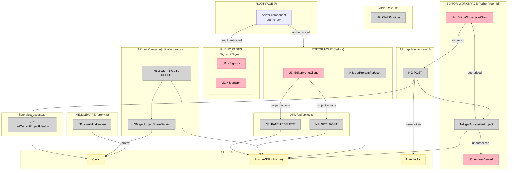

# Feature 03 — Auth

## Frame

### Problem

- Unauthenticated users can reach protected routes with no redirect
- Canvas projects have no owner — there is no user identity in the system
- Collaborators have no structured way to access shared projects
- Liveblocks rooms have no auth gate — any request can join any room

### Outcome

- Users sign in via Clerk and are redirected away from protected routes if unauthenticated
- Every project has a single owner (Clerk user ID)
- Collaborators can be invited by email and access their shared projects
- Liveblocks room tokens are only issued to verified project members
- Clerk sign-in/sign-up UI matches the app's dark design system

---

## Requirements (R)

| ID  | Requirement                                                                      | Status      |
| --- | -------------------------------------------------------------------------------- | ----------- |
| R0  | Users can sign in and sign up                                                    | Core goal   |
| R1  | Unauthenticated requests to protected routes redirect to /sign-in                | Must-have   |
| R2  | Authenticated users land on the editor home (project list)                       | Must-have   |
| R3  | Users can create, rename, and delete projects (owner only)                       | Must-have   |
| R4  | Project list separates owned projects from shared (collaborator) projects        | Must-have   |
| R5  | Only the owner or a collaborator can access a project workspace                  | Must-have   |
| R6  | The owner can add and remove collaborators by email                              | Must-have   |
| R7  | API route mutations enforce auth and ownership checks at every boundary          | Must-have   |
| R8  | Liveblocks room tokens are issued only to verified project members               | Must-have   |
| R9  | Clerk sign-in/sign-up appearance matches the app's dark design system            | Must-have   |

---

## A: Clerk-native auth with email-based collaboration

Clerk handles all identity. Projects store the Clerk `userId` as owner. Collaborators are tracked by email in a join table. Access is resolved server-side before every protected page and mutation.

| Part   | Mechanism                                                                                                                                   |
| ------ | ------------------------------------------------------------------------------------------------------------------------------------------- |
| **A1** | **Route protection** — `proxy.ts`: `clerkMiddleware` + `createRouteMatcher`; all routes protected except `/sign-in(.*)` and `/sign-up(.*)` |
| **A2** | **Clerk provider** — `app/layout.tsx`: `ClerkProvider` with dark theme `appearance` vars mapped to the app's CSS custom property tokens     |
| **A3** | **Sign-in / Sign-up pages** — split-panel layout: marketing left column + Clerk embedded `<SignIn>` / `<SignUp>` on the right               |
| **A4** | **Root redirect** — `app/page.tsx`: server component; authenticated → `/editor`, unauthenticated → `/sign-in`                              |
| **A5** | **Project DB model** — `prisma/models/project.prisma`: `Project` (ownerId, name, status, canvasBlobUrl), `ProjectCollaborator` (projectId, email unique), `ProjectSpec`, `TaskRun` |
| **A6** | **Project access helpers** — `lib/project-access.ts`: `getCurrentProjectIdentity()` (Clerk `auth()` + `currentUser()`), `getAccessibleProject()` (owner OR email-matched collaborator OR), `userHasProjectAccess()` |
| **A7** | **Project CRUD API** — `GET /api/projects` (list owned); `POST /api/projects` (create, ownerId = userId); `PATCH /api/projects/[projectId]` (rename, owner only); `DELETE /api/projects/[projectId]` (delete, owner only) |
| **A8** | **Collaborator management API** — `GET /api/projects/[projectId]/collaborators` (share details with Clerk profile lookup); `POST` (add by email, owner only, no self-invite, no dupes); `DELETE` (remove by email, owner only) |
| **A9** | **Liveblocks auth endpoint** — `POST /api/liveblocks-auth`: verifies membership via `userHasProjectAccess()`, issues session token with userInfo (name, avatar, color from `getUserColor()`) |
| **A10** | **Editor home page** — `app/editor/page.tsx`: server component; fetches owned + shared projects via `lib/projects.getProjectsForUser()`, passes to `EditorHomeClient` |
| **A11** | **Editor workspace access gate** — `app/editor/[roomId]/page.tsx`: server component; `getAccessibleProject()` → unauthorized renders `<AccessDenied>`, authorized renders `<EditorWorkspaceClient>` |

---

## Fit Check (R × A)

| Req | Requirement                                                                      | Status    | A  |
| --- | -------------------------------------------------------------------------------- | --------- | -- |
| R0  | Users can sign in and sign up                                                    | Core goal | ✅ |
| R1  | Unauthenticated requests to protected routes redirect to /sign-in                | Must-have | ✅ |
| R2  | Authenticated users land on the editor home (project list)                       | Must-have | ✅ |
| R3  | Users can create, rename, and delete projects (owner only)                       | Must-have | ✅ |
| R4  | Project list separates owned projects from shared (collaborator) projects        | Must-have | ✅ |
| R5  | Only the owner or a collaborator can access a project workspace                  | Must-have | ✅ |
| R6  | The owner can add and remove collaborators by email                              | Must-have | ✅ |
| R7  | API route mutations enforce auth and ownership checks at every boundary          | Must-have | ✅ |
| R8  | Liveblocks room tokens are issued only to verified project members               | Must-have | ✅ |
| R9  | Clerk sign-in/sign-up appearance matches the app's dark design system            | Must-have | ✅ |

**Selected shape: A**

---

## Breadboard

### UI Affordances

| ID  | Place                   | Name                         | Wires Out                        |
| --- | ----------------------- | ---------------------------- | -------------------------------- |
| U1  | Sign-in page            | `<SignIn>` (Clerk embedded)  | → Clerk auth service             |
| U2  | Sign-up page            | `<SignUp>` (Clerk embedded)  | → Clerk auth service             |
| U3  | Editor home             | `<EditorHomeClient>`         | → N7 (project CRUD API)          |
| U4  | Editor workspace        | `<EditorWorkspaceClient>`    | → N9 (Liveblocks auth endpoint)  |
| U5  | Editor workspace        | `<AccessDenied>`             | (terminal — no wires out)        |

### Non-UI Affordances

| ID  | Place                                          | Name                         | Wires Out                                 |
| --- | ---------------------------------------------- | ---------------------------- | ----------------------------------------- |
| N1  | `proxy.ts`                                     | `clerkMiddleware`            | → Clerk; `auth.protect()` on all non-public routes |
| N2  | `app/layout.tsx`                               | `ClerkProvider`              | → Clerk; wraps all pages                  |
| N3  | `lib/project-access.ts`                        | `getCurrentProjectIdentity`  | → Clerk `auth()`, `currentUser()`         |
| N4  | `lib/project-access.ts`                        | `getAccessibleProject`       | → Prisma (Project + ProjectCollaborator)  |
| N5  | `lib/projects.ts`                              | `getProjectsForUser`         | → Prisma (Project, ProjectCollaborator)   |
| N6  | `lib/project-collaborators.ts`                 | `getProjectShareDetails`     | → Prisma, Clerk `clerkClient()`           |
| N7  | `app/api/projects/route.ts`                    | GET / POST                   | → Prisma                                  |
| N8  | `app/api/projects/[projectId]/route.ts`        | PATCH / DELETE               | → Prisma                                  |
| N9  | `app/api/liveblocks-auth/route.ts`             | POST                         | → N3, N4, Liveblocks SDK                  |
| N10 | `app/api/projects/[projectId]/collaborators`   | GET / POST / DELETE          | → Prisma, N6 (Clerk user lookup)          |

### Wiring Diagram

**Legend:**
- **Pink nodes (U)** = UI affordances (things users see / interact with)
- **Grey nodes (N)** = Code affordances (middleware, handlers, helpers, data stores)
- **Yellow nodes** = External services (Clerk, PostgreSQL, Liveblocks)
- **Solid lines** = Wires Out (calls, triggers, writes)
