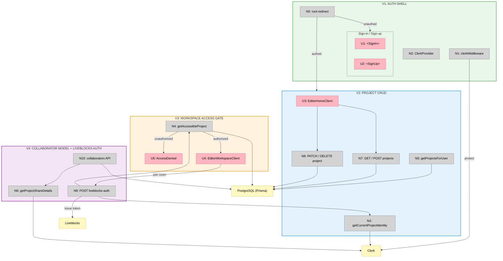

# Feature 03 — Auth — Slices

**Shape:** A (Clerk-native auth with email-based collaboration)

---

## Slice Definitions

| Slice | Name                              | Parts          | Demo                                                                              |
| ----- | --------------------------------- | -------------- | --------------------------------------------------------------------------------- |
| V1    | Auth Shell                        | A1, A2, A3, A4 | Hit app → redirect to sign-in. Sign in → land on editor (empty state).           |
| V2    | Project CRUD                      | A5, A6*, A7, A10 | Create project → appears in My Projects list. Rename and delete work.           |
| V3    | Workspace Access Gate             | A6†, A11       | Click owned project → workspace opens. Unknown URL → AccessDenied component.     |
| V4    | Collaborator Model + Liveblocks Auth | A8, A9      | Add collaborator by email → they can join the room. Non-member gets 403.          |

*A6 in V2: `getCurrentProjectIdentity()` and `getProjectsForUser()`
†A6 in V3: `getAccessibleProject()` and `userHasProjectAccess()`

---

## V1: Auth Shell

**Goal:** Clerk is wired up. All routes are protected. Users can sign in and sign up. Authenticated users land on the editor; unauthenticated users are redirected.

### Affordances

| ID  | Type   | Place                        | Name                        | Wires Out                            |
| --- | ------ | ---------------------------- | --------------------------- | ------------------------------------ |
| N1  | Non-UI | `proxy.ts`                   | `clerkMiddleware`           | → Clerk; `auth.protect()` all non-public routes |
| N2  | Non-UI | `app/layout.tsx`             | `ClerkProvider`             | → Clerk; wraps all pages             |
| U1  | UI     | `/sign-in`                   | `<SignIn>` (Clerk embedded) | → Clerk auth service                 |
| U2  | UI     | `/sign-up`                   | `<SignUp>` (Clerk embedded) | → Clerk auth service                 |
| N0  | Non-UI | `app/page.tsx`               | Root redirect               | → `/editor` (authed), `/sign-in` (unauthed) |

### Demo

Visit `/` → redirected to `/sign-in`. Sign in → redirected to `/editor` (empty state is fine). Visit any protected route while unauthenticated → redirected to `/sign-in`.

---

## V2: Project CRUD

**Goal:** Projects exist in the database. The editor home shows owned and shared projects. Users can create, rename, and delete projects.

### Affordances

| ID  | Type   | Place                                   | Name                        | Wires Out                       |
| --- | ------ | --------------------------------------- | --------------------------- | ------------------------------- |
| N3  | Non-UI | `lib/project-access.ts`                 | `getCurrentProjectIdentity` | → Clerk `auth()`, `currentUser()` |
| N5  | Non-UI | `lib/projects.ts`                       | `getProjectsForUser`        | → Prisma (Project, ProjectCollaborator) |
| N7  | Non-UI | `app/api/projects/route.ts`             | GET / POST                  | → Prisma                        |
| N8  | Non-UI | `app/api/projects/[projectId]/route.ts` | PATCH / DELETE              | → Prisma                        |
| U3  | UI     | `/editor`                               | `<EditorHomeClient>`        | → N7, N8                        |

### Demo

Sign in → editor home shows "My Projects" list (initially empty). Create a project → it appears. Rename it → name updates. Delete it → it disappears.

---

## V3: Workspace Access Gate

**Goal:** Navigating to a project workspace enforces ownership/collaborator check server-side. Unauthorized renders AccessDenied; authorized renders the workspace shell.

### Affordances

| ID  | Type   | Place                               | Name                    | Wires Out                           |
| --- | ------ | ----------------------------------- | ----------------------- | ----------------------------------- |
| N4  | Non-UI | `lib/project-access.ts`             | `getAccessibleProject`  | → Prisma (Project + ProjectCollaborator) |
| U4  | UI     | `/editor/[roomId]`                  | `<EditorWorkspaceClient>` | → N9 (Liveblocks auth, V4)        |
| U5  | UI     | `/editor/[roomId]`                  | `<AccessDenied>`        | (terminal)                          |

### Demo

Click an owned project → workspace opens (even if canvas is empty). Navigate to `/editor/unknown-id` → AccessDenied component renders.

---

## V4: Collaborator Model + Liveblocks Auth

**Goal:** The owner can add/remove collaborators by email. Liveblocks room tokens are only issued to verified project members.

### Affordances

| ID  | Type   | Place                                              | Name                     | Wires Out                         |
| --- | ------ | -------------------------------------------------- | ------------------------ | --------------------------------- |
| N6  | Non-UI | `lib/project-collaborators.ts`                     | `getProjectShareDetails` | → Prisma, Clerk `clerkClient()`   |
| N10 | Non-UI | `app/api/projects/[projectId]/collaborators`       | GET / POST / DELETE      | → Prisma, N6                      |
| N9  | Non-UI | `app/api/liveblocks-auth/route.ts`                 | POST                     | → N3 (V2), N4 (V3), Liveblocks   |

### Demo

Add a collaborator by email → they can access the project workspace. Remove them → they get 403 from Liveblocks auth. Non-member calling `/api/liveblocks-auth` gets 403.

---

## Sliced Breadboard

