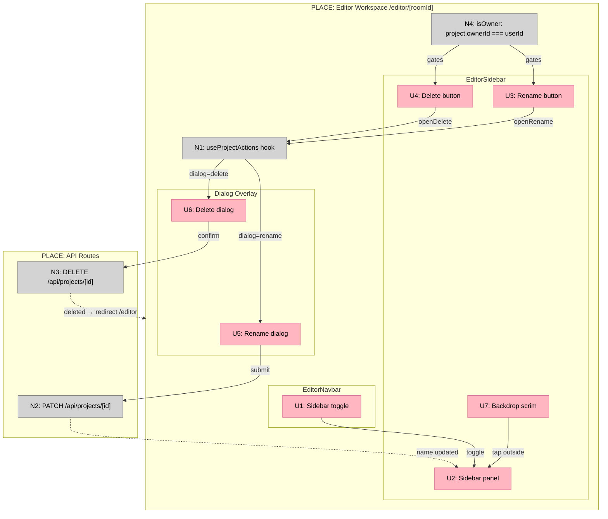

# Feature 04 — Project Dialogs: Shaping Doc

## Requirements (R)

| ID | Requirement | Status |
|----|-------------|--------|
| R0 | Editor home CTA to create a project | Out — already exists |
| R1 | Create Project dialog with live slug preview | Out — create lives in editor-home-client.tsx (unchanged) |
| R2 | Users can rename an owned project | Undecided |
| R3 | Users can delete an owned project | Undecided |
| R4 | Delete action requires explicit destructive confirmation | Undecided |
| R5 | Project item actions appear only on owned projects, not shared ones | Undecided |
| R6 | Mobile users can close the sidebar by tapping outside it | Undecided |
| R7 | Sidebar provides rename and delete actions for the open project | Must-have |
| R8 | No API calls or persistence (mock data) | Out — real API already exists |

---

## Shape A: Sidebar project actions + dialogs

### Parts

| Part | Mechanism |
|------|-----------|
| **A1** | `isOwner` check — `project.ownerId === userId` passed from server into `EditorWorkspaceClient`, gates U3 and U4 |
| **A2** | Rename button (U3) + Delete button (U4) rendered in sidebar project header, hidden when `!isOwner` |
| **A3** | `useProjectActions` hook — `dialog: 'rename' \| 'delete' \| null`, `name` form field, `loading` flag, `open/close` methods |
| **A4** | Rename dialog — name input prefilled via hook, auto-focus, Enter submits, calls PATCH `/api/projects/[id]`, updates local project name on success |
| **A5** | Delete dialog — destructive confirm only, calls DELETE `/api/projects/[id]`, redirects to `/editor` on success |
| **A6** | Mobile backdrop scrim — rendered behind sidebar when viewport is narrow, tap closes sidebar |

---

## Fit Check (R × A)

| Req | Requirement | Status | A |
|-----|-------------|--------|---|
| R2 | Users can rename an owned project | Undecided | ✅ |
| R3 | Users can delete an owned project | Undecided | ✅ |
| R4 | Delete action requires explicit destructive confirmation | Undecided | ✅ |
| R5 | Project item actions appear only on owned projects, not shared ones | Undecided | ✅ |
| R6 | Mobile users can close the sidebar by tapping outside it | Undecided | ✅ |
| R7 | Sidebar provides rename and delete actions for the open project | Must-have | ✅ |

---

## Breadboard

### UI Affordances

| ID | Affordance | Place | Wires Out |
|----|-----------|-------|-----------|
| U1 | Sidebar toggle button | EditorNavbar | → toggles sidebar open/close (existing) |
| U2 | Sidebar panel overlay | EditorSidebar | — |
| U3 | Rename button (owner only) | EditorSidebar — project header | → N1.openRename() |
| U4 | Delete button (owner only) | EditorSidebar — project header | → N1.openDelete() |
| U5 | Rename dialog (name input, auto-focus, Enter submits) | Dialog overlay | → N2 on submit |
| U6 | Delete dialog (destructive confirm button) | Dialog overlay | → N3 on confirm |
| U7 | Mobile backdrop scrim | EditorSidebar | → closes sidebar on tap |

### Non-UI Affordances

| ID | Affordance | Place | Wires Out |
|----|-----------|-------|-----------|
| N1 | `useProjectActions` hook (dialog, name, loading state) | EditorWorkspaceClient | → controls U5, U6 open/close |
| N2 | PATCH `/api/projects/[id]` — rename handler | API route | -.-> updated project name to U2 |
| N3 | DELETE `/api/projects/[id]` — delete handler + `router.push('/editor')` | API route + EditorWorkspaceClient | — |
| N4 | `isOwner`: `project.ownerId === userId` | EditorWorkspaceClient (server prop) | → gates U3, U4 visibility |

### Wiring Diagram

**Legend:**
- **Pink nodes (U)** = UI affordances (things users see/interact with)
- **Grey nodes (N)** = Code affordances (handlers, hooks, API routes)
- **Solid lines** = Wires Out (calls, triggers, writes)
- **Dashed lines** = Returns To (return values, responses)
