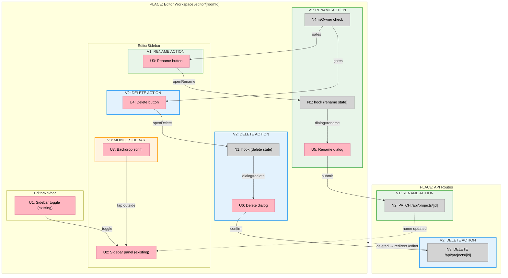

# Feature 04 — Project Dialogs: Slices

## Sliced Breadboard

---

## Slices Grid

|  |  |  |
|:--|:--|:--|
| **V1: RENAME ACTION** ⏳ PENDING  • `isOwner`: `project.ownerId === userId` • Rename button in sidebar header • `useProjectActions` hook (rename) • Rename dialog — prefilled, auto-focus, Enter submits • PATCH `/api/projects/[id]` • Local `projectName` state update  *Demo: Own project → rename button visible → dialog opens → submit → sidebar name updates* | **V2: DELETE ACTION** ⏳ PENDING  • Delete button in sidebar header • `useProjectActions` hook (delete) • Delete dialog — destructive confirm • DELETE `/api/projects/[id]` • Redirect to `/editor` on success • &nbsp;  *Demo: Own project → delete button → confirm → redirected to home* | **V3: MOBILE SIDEBAR** ⏳ PENDING  • Backdrop scrim div (fixed, full-viewport) • Tap-outside closes sidebar • Scrim only renders when sidebar is open • &nbsp; • &nbsp; • &nbsp;  *Demo: Narrow viewport → sidebar open → tap outside → sidebar closes* |

---

## V1 Slice Detail

### Goal
Rename action end-to-end: button in sidebar → dialog → PATCH API → name updates in place.

### Affordances

| ID | Affordance | File |
|----|-----------|------|
| N4 | `isOwner` computed server-side, passed as prop | `app/editor/[roomId]/page.tsx` |
| U3 | Rename button in sidebar project header (hidden when `!isOwner`) | `components/editor/editor-sidebar.tsx` |
| N1 | `useProjectActions` hook — `dialog`, `name`, `loading`, `open/close` | `hooks/use-project-actions.ts` (new) |
| U5 | Rename dialog — prefilled input, `onOpenAutoFocus` focuses ref, Enter submits | `components/editor/editor-workspace-client.tsx` |
| N2 | PATCH `/api/projects/[id]` — already exists from Feature 03 | `app/api/projects/[id]/route.ts` |
| — | `projectName` local state initialized from `project.name` server prop | `components/editor/editor-workspace-client.tsx` |

### Key implementation notes
- `isOwner`: `auth()` is already called in `getCurrentProjectIdentity`. In `page.tsx`, run `getAccessibleProject` and `getCurrentProjectIdentity` in parallel via `Promise.all`. Compare `project.ownerId === identity.userId`.
- Auto-focus: `<DialogContent onOpenAutoFocus={(e) => { e.preventDefault(); inputRef.current?.focus(); }}>` — from spike.
- After PATCH success: `setProjectName(updated.name)` — no `router.refresh()` (soft-nav state loss issue from spike).
- Pass `projectName` and `onRename` down from `EditorWorkspaceClient` to `EditorSidebar` so the header reflects the updated name.

---

## V2 Slice Detail

### Goal
Delete action end-to-end: button in sidebar → confirm dialog → DELETE API → redirect to `/editor`.

### Affordances

| ID | Affordance | File |
|----|-----------|------|
| U4 | Delete button in sidebar project header (hidden when `!isOwner`) | `components/editor/editor-sidebar.tsx` |
| N1 | Extend `useProjectActions` hook with `openDelete`, `closeDelete` | `hooks/use-project-actions.ts` |
| U6 | Delete dialog — destructive confirm button, no input | `components/editor/editor-workspace-client.tsx` |
| N3 | DELETE `/api/projects/[id]` — already exists from Feature 03 | `app/api/projects/[id]/route.ts` |
| — | `router.push('/editor')` after successful delete | `components/editor/editor-workspace-client.tsx` |

### Key implementation notes
- Reuse `isOwner` prop already threaded in V1 — no additional server changes.
- Loading state in hook prevents double-submit on confirm.
- Delete button uses `variant="destructive"` from shadcn Button.

---

## V3 Slice Detail

### Goal
Mobile sidebar closes when user taps the backdrop scrim behind it.

### Affordances

| ID | Affordance | File |
|----|-----------|------|
| U7 | Backdrop `div` — `fixed inset-0 z-10 bg-black/40` — rendered when sidebar is open | `components/editor/editor-workspace-client.tsx` |
| — | `onClick` on backdrop calls `setSidebarOpen(false)` | `components/editor/editor-workspace-client.tsx` |

### Key implementation notes
- Sidebar sits at `z-20`, backdrop at `z-10`, canvas at default z.
- Backdrop renders unconditionally on mobile when sidebar is open — no media query JS needed. Use Tailwind's `md:hidden` to suppress on desktop.
- No new components needed — two lines added to `EditorWorkspaceClient`.
